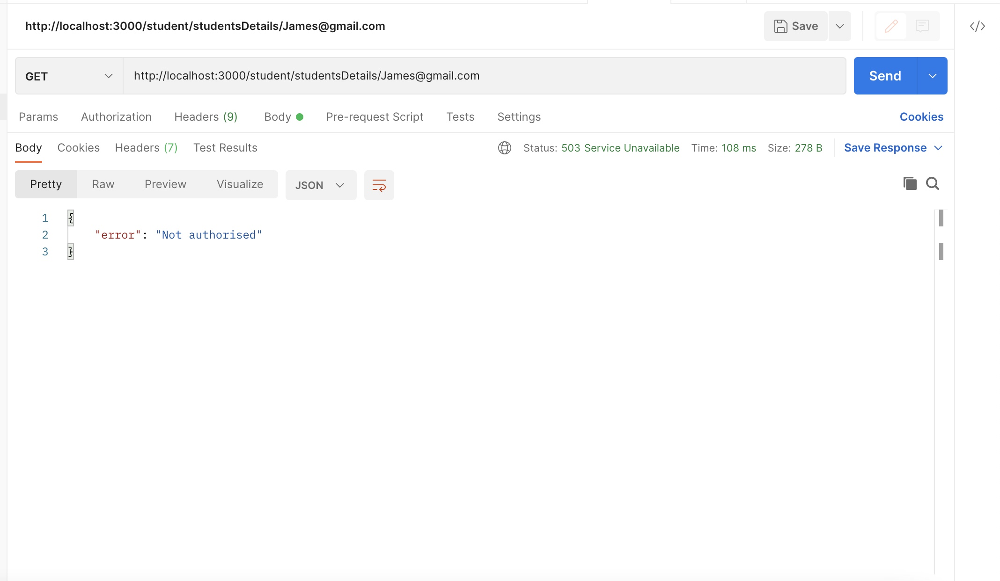
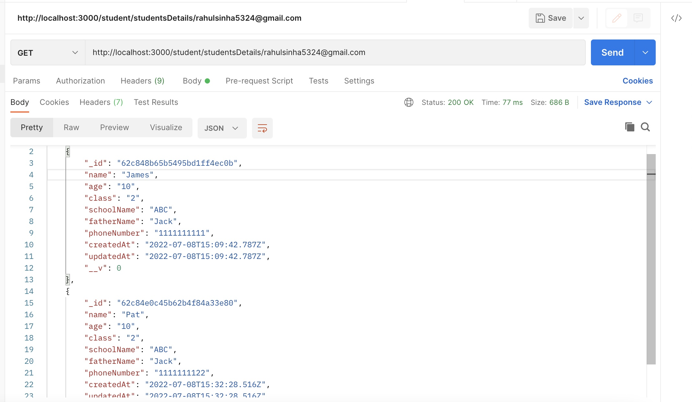
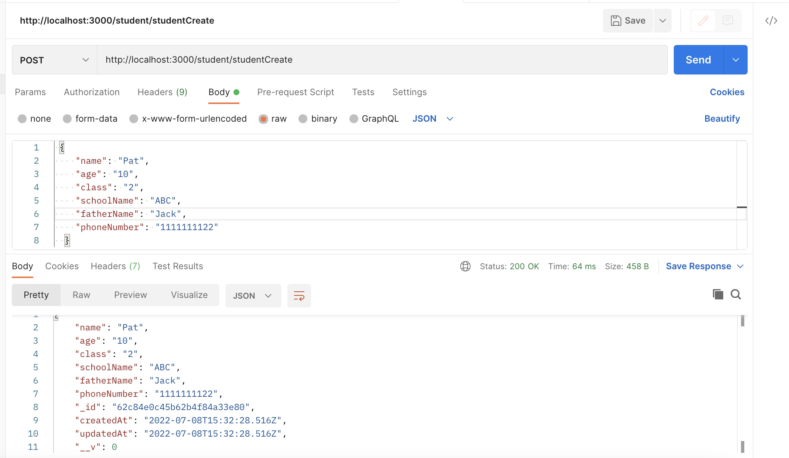
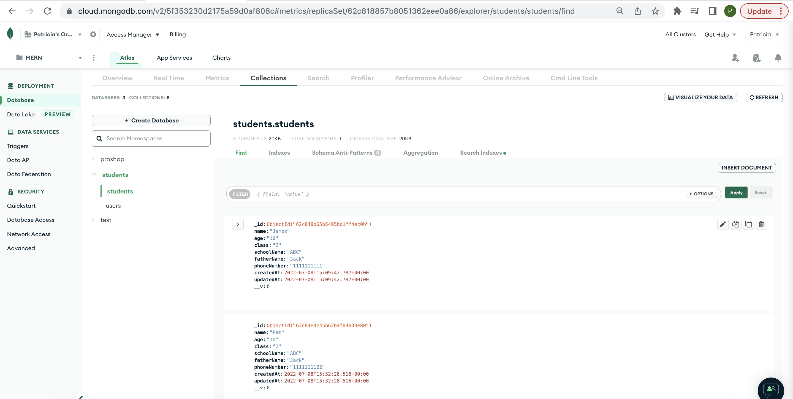
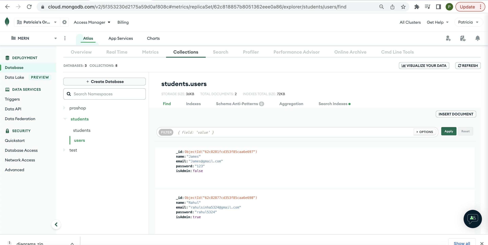

# student-management

## Output Screenshots

1. Get Students details with a non admin user. Output - Unathorised
   

2. Get Students with a admin user
   

3. Create Student
   

4. Students DB
   

5. User DB
   
